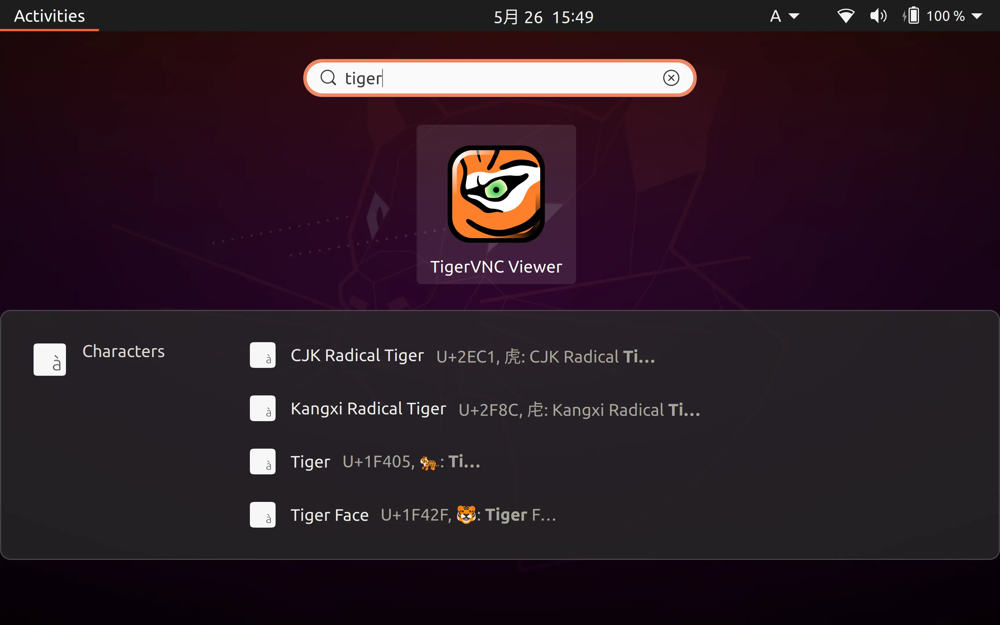
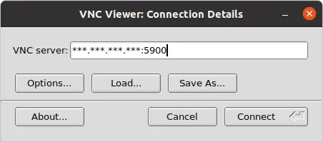
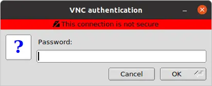

# サーバの準備

## VNCサーバのインストール

VNCサーバには、TigerVNCを使用する。

```bash
sudo apt update -y
sudo apt install -y tigervnc-scraping-server
```


## サーバの設定

以下のコマンドを入力し、パスワードを設定する。
表示専用パスワードを設定するか聞かれるので、特に理由がなければ`n`を入力する。

```bash
vncpasswd
```


## VNCサーバの起動

以下のコマンドを実行することで、VNCサーバを起動できる。
`display`オプションで、ディスプレイ番号を指定することができる。

```bash
x0tigervncserver -rfbauth ~/.vnc/passwd -display :1
```

また、安全なネットワーク内でなければ、`-localhost`オプションを付け、ローカルホストからのみの接続を許可することができる。
このとき、クライアント側はSSHポートフォワーディングを使用する。

```bash
x0tigervncserver -rfbauth ~/.vnc/passwd -display :1 -localhost
```


# クライアントの準備

## VNCクライアントのインストール

VNCクライアントには、TigerVNCを使用する。

```bash
sudo apt update -y
sudo apt install -y tigervnc-viewer
```


## クライアントの設定

以下のコマンドを実行し、設定を保存する。

```bash
cat <<EOF > ~/.vnc/default.tigervnc
TigerVNC Configuration file Version 1.0

ServerName=
X509CA=
X509CRL=
SecurityTypes=None,VncAuth,Plain,TLSNone,TLSVnc,TLSPlain,X509None,X509Vnc,X509Plain
DotWhenNoCursor=0
AutoSelect=0
FullColor=1
LowColorLevel=2
PreferredEncoding=Tight
CustomCompressLevel=0
CompressLevel=2
NoJPEG=0
QualityLevel=2
FullScreen=0
FullScreenAllMonitors=1
DesktopSize=
RemoteResize=1
ViewOnly=0
Shared=1
AcceptClipboard=1
SendClipboard=1
SendPrimary=1
SetPrimary=1
MenuKey=F8
FullscreenSystemKeys=1

EOF
```


## VNCクライアントの起動・接続

### GUIでの接続

まず、`Applications`から`TigerVNC Viewer`を起動する。



次に、サーバのIPアドレスとポート番号を入力し、`Connect`をクリックする。



最後に、パスワードを入力し、`OK`をクリックする。




### コマンドラインでの接続

まず、サーバと同じVNCパスワードを設定する。

```bash
vncpasswd
```

そして、以下のコマンドを実行することで、VNCクライアントを起動し、サーバに接続できる。

```bash
vncviewer <IPアドレス>:<ポート番号> -passwd ~/.vnc/passwd
```