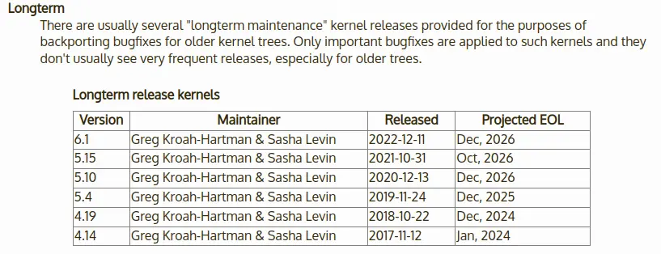

## 1. カーネルインストーラをインストールする

以下をターミナルにコピペして実行する。

```bash
wget https://raw.githubusercontent.com/pimlie/ubuntu-mainline-kernel.sh/master/ubuntu-mainline-kernel.sh
sudo install ubuntu-mainline-kernel.sh /usr/local/bin
```

## 2. 現在のカーネルバージョンを確認する

Ubuntu 20.04のデフォルトは5.4。以下を実行してそれを確認できる。

```bash
uname -r
```

## 3. インストールしたいカーネルバージョンを決める

[The Linux Kernel Archives](https://www.kernel.org/category/releases.html)からカーネルのバージョンを調べられる。

特に理由がなければ、最新のLTSバージョンにすると良い。その場合、以下の画像のようなLTSバージョン一覧表がサイト内にあるのでそれを参考にする。



The Linux Kernel Archivesに記載されているLTSバージョン一覧表

今回は、 `6.1.z` にする。

次に、以下のコマンドを実行し、 `z` にハマる数字を決める。コマンドの `6.1.` は適当な数字に置き換える。

```bash
ubuntu-mainline-kernel.sh -r v6.1.
```

実行結果は以下のようになる。

```
Downloading index from kernel.ubuntu.com
v6.1.0	v6.1.1	v6.1.2	v6.1.3	v6.1.4	v6.1.5	v6.1.6	v6.1.7	v6.1.8	v6.1.9	v6.1.10	v6.1.11
v6.1.12	v6.1.13	v6.1.14	v6.1.15	v6.1.16	v6.1.17	v6.1.18	v6.1.19	v6.1.20	v6.1.21	v6.1.22	v6.1.23
v6.1.24	v6.1.25	v6.1.26	v6.1.27	v6.1.28	v6.1.29
```

コマンドの実行結果より、 `v6.1.29` が最新のインストール可能なLTSバージョンであることが分かる。

## 4. 新しいカーネルをインストールする

以下のコマンドを実行することで指定のバージョンのカーネルをインストールすることができる。コマンドの `v6.1.29` は適当なバージョンに置き換える。

また、 `-i` オプションに値を渡さず実行すれば、最新バージョンが自動で選択される。

```bash
ubuntu-mainline-kernel.sh -i v6.1.29
```

インストール終了後に再起動して完了。

```bash
reboot
```